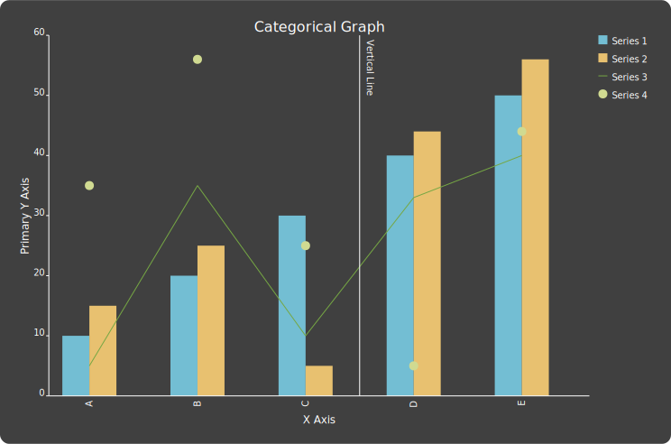

# simplegraph

This is a simple little graphing package for making graphs and exporting them as base64-encoded SVGs.

## Categorical Graph

The categorical graph is for data that comes in distinct categories. It can generate a bar chart, a stacked bar chart, dots, or lines.

Here is an example of how to make a graph:

```
from simplegraph import CategoricalGraph

graph = CategoricalGraph(
        width=600,
        height=400,
        bar_width=30,
        x_left_padding=40,
        x_right_padding=120,
        y_top_padding=10,
        y_bottom_padding=30,
        stacked=False,
        background_color="#404040",
    )

graph.x_labels = ["A", "B", "C", "D", "E"]
graph.x_axis_label = "X Axis"
graph.primary_y_axis_label = "Primary Y Axis"

graph.add_series([10, 20, 30, 40, 50], legend_label="Series 1")
graph.add_series([15, 25, 5, 44, 56], legend_label="Series 2")
graph.add_series([5, 35, 10, 33, 40], legend_label="Series 3", series_type="line")
graph.add_series([35, 56, 25, 5, 44], legend_label="Series 4", series_type="dot")

# Get the SVG string in base64 format
svg_base64 = graph.to_base64_src()

# Print the SVG string in an img tag so your browser can display it
print(f"\n")
```


## Ribbon Graph

The ribbon graph is for comparing two numbers on the same scale and a third number on a different scale (represented through color).

The three series must be added in order, with the first representing the back of the ribbon, the second representing the point, and the (optional) third representing the color.

Here's an example:

```
from simplegraph import RibbonGraph

graph = RibbonGraph(
    width=600,
    height=400,
    bar_width=30,
    x_left_padding=60,
    x_right_padding=80,
    y_top_padding=40,
    y_bottom_padding=30,
    background_color="#404040",
)

graph.x_labels = ["A", "B", "C", "D", "E"]
graph.x_axis_label = "X Axis"
graph.primary_y_axis_label = "Primary Y Axis"

graph.add_series([10, 20, 30, 40, 50], legend_label="Series 1", print_values=True)
graph.add_series([20, 30, 40, 30, 20], legend_label="Series 2", print_values=True)
graph.add_series(
    [-10, -20, 30, 20, 10], legend_label="Color Series", print_values=True
)

# Get the SVG string in base64 format
svg_base64 = graph.to_base64_src()

# Print the SVG string in an img tag so your browser can display it
print(f"\n")
```


## Bubble and Arrow Graph
The bubble and arrow graph is for displaying relationships between nodes in a network.

The user adds bubbles, which are displayed in clockwise order around a larger circle. Then the user can add arrows that exit from one bubble and enter another. Arrow width is scaled to show more important connections.

Here's an example:
```
from simplegraph import BubbleAndArrowGraph

graph = BubbleAndArrowGraph(
    width=600,
    height=600,
    background_color="#404040",
)

# Optional str label param can be referred to later when defining arrows
graph.add_bubble(100, None, "Bubble 0", label="big_bubble")

# Otherwise bubbles must be referred to by their index number
graph.add_bubble(50, 25, "Bubble 1")
graph.add_bubble(25, 12.5, "Bubble 2")

graph.add_arrow(
    origin="big_bubble",
    destination=1,
    size=60,
)
graph.add_arrow(
    origin="big_bubble",
    destination=2,
    size=40,
)
graph.add_arrow(
    origin=1,
    destination=2,
    size=30,
)

# Arrows pointing to their origin will loop around
graph.add_arrow(
    origin=2,
    destination=2,
    size=20,
)

# Get the SVG string in base64 format
svg_base64 = graph.to_base64_src()

# Print the SVG string in an img tag so your browser can display it
print(f"\n")
```
